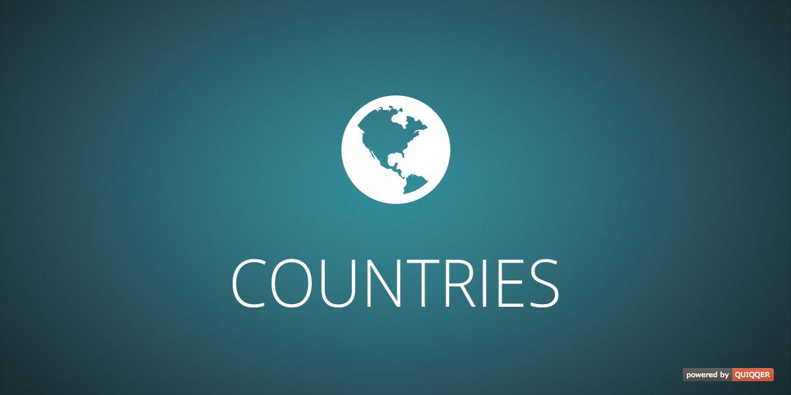

QUIQQER Country package
========

The package provides more than 200 countries with their corresponding country codes.

Package name:

    quiqqer/countries

Features
--------

- More than 200 countries
- To each country the ISO codes
- PHP Country Classes

Installation
------------

The Package name is: quiqqer/countries

Contribute
----------

- Issue Tracker: https://dev.quiqqer.com/quiqqer/package-countries/issues
- Source Code: https://dev.quiqqer.com/quiqqer/package-countries

Support
-------

If you have found a bug or want to make improvements,
Then you can write an e-mail to support@pcsg.de.

License
-------

MIT

Usage
--------

The quiqqer/countries package includes a Country Select Box Control.
This control builds a \<select> element with all countries.

    {control control="\QUI\Countries\Controls\Select" selected="DE"}

*Attribute*

- selected="DE" -> [optional] The selected entry
